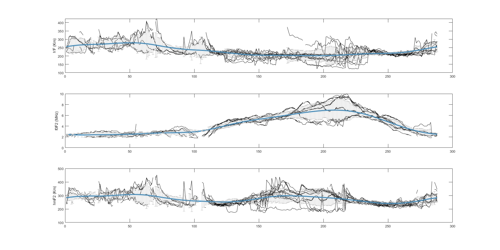
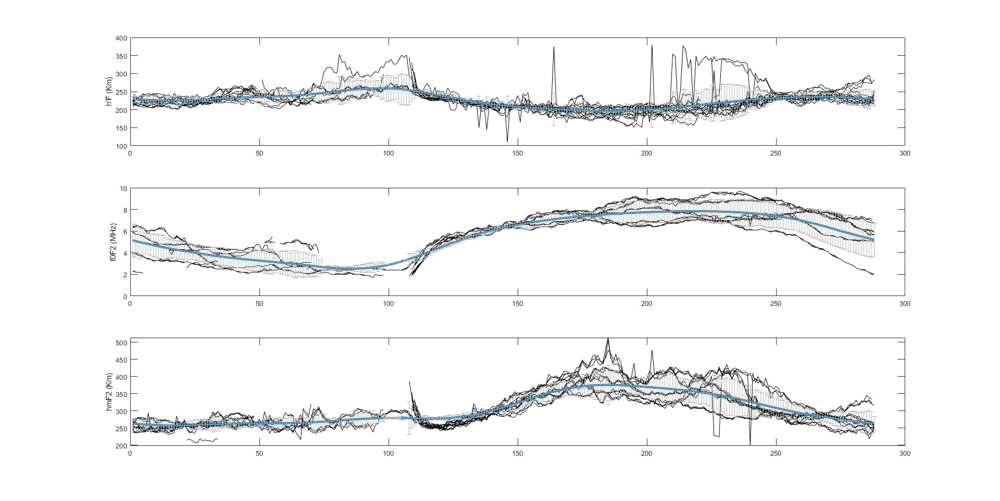
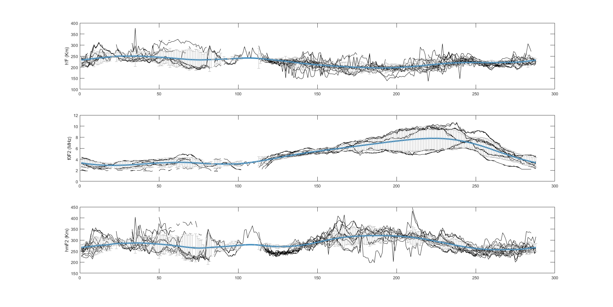

# 📝 Análise de Dados Ionosféricos - SJC, Araguatins e Jataí

Este projeto é um script MATLAB para processamento e análise de dados ionosféricos reduzidos e tratados das estações de São José dos Campos (SP), Araguatins (TO) e Jataí (GO). O objetivo é consolidar os dados de múltiplos arquivos, calcular médias e desvios dos parâmetros **foF2**, **h'F** e **hmF2**, e gerar gráficos com as séries temporais dessas variáveis.

## 🛠 Tecnologias Usadas

- **MATLAB**


## 💡 Objetivo

O objetivo deste projeto é automatizar a leitura, tratamento e análise dos dados ionosféricos das estações SJC, Araguatins e Jataí, possibilitando:

- Tratamento dos dados faltantes
- Geração de séries temporais completas
- Cálculo de médias móveis suavizadas e desvios padrão
- Visualização dos dados com gráficos e barras de erro

## 🚀 Funcionalidades

- Leitura de múltiplos arquivos `.TXT` organizados por estação e período
- Combinação dos dados para obter séries completas
- Processamento e substituição de dados faltantes
- Plotagem de gráficos com médias e barras de erro para h'F, foF2 e hmF2
- Salvamento dos resultados em arquivo `.mat` para uso futuro
- Cálculo do MAE para avaliação de erro noturno

## 📦 Como Rodar o Projeto

### Passo 1: Clonar o Repositório
```bash
git clone https://github.com/lauratrigo/Programa_Sq.git
cd Programa_Sq
```

### Passo 2: Preparar os Arquivos de Dados

Coloque os arquivos .TXT das estações na pasta do projeto, garantindo que sigam o padrão de nomes esperado pelo script.

### Passo 3: Executar o Script no MATLAB

Abra o MATLAB, navegue até a pasta do projeto e execute o script principal:

run programaSqFinal.m


O script processará os dados e exibirá os gráficos.

## 🔧 Detalhes do Script

**Arquivos processados:** múltiplos .TXT com dados das estações

**Parâmetros analisados:**
  
  - **h'F** (altura virtual da camada F)
  
  - **foF2** (frequência crítica da camada F2)
  
  - **hmF2** (altura máxima da camada F2)

  - Utiliza suavização móvel para as médias (janela de 36 amostras)
  
  - Gera gráficos com erro (desvio padrão) para análise visual

## 📂 Estrutura do Projeto

```
Programa_Sq/
├── dados/                    # Arquivos .TXT das estações
├── mediasedesvios.mat        # Arquivo gerado com médias e desvios
├── programaSqFinal           # Script MATLAB principal
└── README.md                 # Documentação do projeto
```
---
## 🤝 Agradecimentos

Este projeto foi desenvolvido para facilitar a análise dos dados ionosféricos coletados em diferentes estações brasileiras, auxiliando no entendimento dos parâmetros ionosféricos durante 2017.

## 📜 Licença

Este projeto está licenciado sob a Licença MIT - veja o arquivo LICENSE para mais detalhes.

<div align="center">
  <h4><strong>Figura 1: São José dos Campos (SP)</strong></h4>
  
</div>

<br>

<div align="center">
  <h4><strong>Figura 2: Araguatins (TO)</strong></h4>
  
</div>

<br>

<div align="center">
  <h4><strong>Figura 3: Jataí (GO)</strong></h4>
  
</div>

